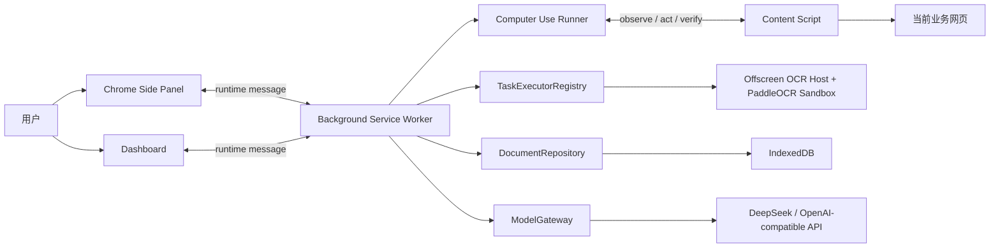

# 甘草 Copilot

甘草 Copilot 是一个基于 Chrome Manifest V3 的本地优先 AI 业务助手扩展。它将大模型对话、浏览器自动操作、页面诊断、文件解析、PaddleOCR、资料问答、页面监控和可复用工作流整合在同一个 Side Panel 中，帮助用户直接在业务网页旁完成信息获取、问题分析与跨页面操作。

> 项目目前处于 V3.x 持续迭代阶段，适合开发测试和内部业务场景验证。涉及提交、保存、删除、支付、发送等高风险操作时，仍应由用户确认后执行。

## 核心能力

### AI 对话与模型配置

- 支持 DeepSeek、甘草业务模型和自定义 OpenAI-compatible API。
- 模型请求统一由后台 `ModelGateway` 处理，支持流式回复、结构化 JSON、工具调用和停止生成。
- API Key 由用户自行配置，仅保存在本机 `chrome.storage.local`，不会写入源码、任务日志或导出结果。
- 支持本地聊天历史、长期 Memory、会话搜索、重命名、归档和继续会话。

### Computer Use 浏览器自动操作

- 将自然语言目标拆分为阶段化任务计划。
- 通过页面语义集合识别菜单、表单、按钮、搜索结果、表格行和文件列表。
- 支持点击、输入、选择、滚动、等待、下载和结构化提取等动作。
- 支持搜索并打开第 N 条自然结果、同名菜单父子路径消歧、业务筛选、真实导出和行内下载。
- 每个任务保留 observation、目标解析、动作、验收证据和失败原因，未真正完成时不会显示成功。

### 文件、OCR 与资料问答

- 支持 PDF、Word、Excel、CSV、Markdown、JSON、文本和常见图片格式。
- 使用本地 PaddleOCR.js、ONNX Runtime Web 和 PDF.js 识别图片及扫描 PDF。
- OCR 结果包含原始文本、字段、表格、章节、页码和低置信度提示。
- 资料统一存入本地 IndexedDB，可按资料空间分类。
- 资料问答支持文件名、页码、章节和 chunk 来源引用。

### 页面诊断与监控

- 采集页面结构、控制台错误、Promise rejection、资源异常及登录、验证码、权限不足等页面信号。
- 无明显错误时也可生成页面检查建议。
- 页面监控支持内容变化、包含指定内容、数值阈值、新增记录和状态转换。
- 每次监控检查独立留痕，连续失败达到上限后自动暂停。

### 任务、工作流与命令

- 统一任务中心支持 Computer Use、页面监控、页面诊断、资料问答、OCR、页面提取和固定工作流。
- 长任务支持运行、停止、重试、结果查看和 Trace 复制。
- 成功的 Computer Use 任务可保存为参数化工作流草稿。
- 支持创建、编辑、启停、版本化、导入和导出自定义命令。

## 界面入口

- **Side Panel**：日常对话、自动操作、附件、页面诊断、问资料和快捷命令。
- **工具箱**：资料中心、自动化工作流、任务中心、记忆中心、自定义命令、模型设置和健康检查。
- **Dashboard**：任务运行记录、模型配置、工作流编辑和自动化管理。

## 技术架构



主要技术栈：

- Chrome Extension Manifest V3
- React 18、TypeScript、Vite、Ant Design
- IndexedDB、`chrome.storage.local`、`chrome.alarms`、Downloads API
- PaddleOCR.js、ONNX Runtime Web、PDF.js
- Vitest、Playwright

更详细的模块和调用链请阅读 [docs/architecture.md](docs/architecture.md)。

## 本地开发

### 环境要求

- Node.js 18 或更高版本
- pnpm
- Chrome 或 Chromium

### 安装依赖

```bash
pnpm install
```

### 构建扩展

```bash
pnpm build
```

构建产物位于 `dist/`。

### 加载到 Chrome

1. 打开 `chrome://extensions/`。
2. 开启右上角的“开发者模式”。
3. 点击“加载已解压的扩展程序”。
4. 选择本项目的 **`dist/` 目录**。
5. 打开任意普通 `http/https` 页面，从 Chrome Side Panel 中启动甘草 Copilot。

> Chrome 内置页、Chrome Web Store 和部分受保护页面不允许 Content Script 注入，因此无法执行页面自动操作。

### 配置模型

1. 打开插件工具箱。
2. 进入“模型设置”。
3. 选择 DeepSeek、甘草业务模型或 OpenAI-compatible。
4. 填写 Base URL、模型名称和 API Key。
5. 点击“测试连接”，成功后保存并设为活动模型。

项目不提供内置默认 Key。未配置模型时，对话、AI 规划、页面诊断和资料问答会返回 `MODEL_NOT_CONFIGURED`，但纯本地资料管理和部分确定性工具仍可使用。

## 常用脚本

```bash
# TypeScript + 单测 + 构建 + 扩展 E2E
pnpm verify

# 单元测试
pnpm test

# 生产构建
pnpm build

# 构建并运行无头扩展 E2E
pnpm test:e2e

# 有界面地运行扩展 E2E
pnpm test:e2e:headed

# 持续监听构建
pnpm watch
```

当前本地质量基线：

- TypeScript 检查通过
- `36` 个 Vitest 测试文件、`197` 个测试通过
- Vite 生产构建通过
- Chromium 扩展 E2E：`4` 条通过，`1` 条依赖公网的 live 用例默认跳过

## 项目目录

```text
src/
├── background/       # Service Worker、模型网关、任务执行器、Computer Use
├── content/          # 页面观察、DOM 动作、控制台错误和登录态桥接
├── dashboard/        # 任务中心、模型设置和自动化工作台
├── offscreen/        # PaddleOCR Offscreen Host
├── shared/           # 类型、Repository、任务记录、Memory、监控和导出工具
└── sidePanel/        # Chat、附件、OCR、资料中心、工具箱和任务卡
public/
├── manifest.json
└── ocrHost.html
tests/e2e/             # Chromium 扩展端到端测试
docs/                  # 架构和版本就绪说明
```

## 数据与隐私

- 聊天历史、长期记忆、资料、OCR 结果、工作流和任务记录默认保存在本地。
- 页面内容只有在执行相应 AI 功能时才会通过活动模型配置发送给模型服务。
- PaddleOCR 在本地浏览器中运行，模型与 ORT 资源随扩展构建产物加载。
- API Key 在界面中掩码显示，并在日志、Trace 和持久化任务结果中脱敏。
- 不应将密码、Token、身份证号、银行卡号或私钥保存为长期记忆。

扩展当前申请 `tabs`、`storage`、`scripting`、`activeTab`、`downloads`、`alarms`、`offscreen` 和 `sidePanel` 等权限。可选的 `debugger` 权限仅用于增强页面诊断，默认路径不依赖它。

## 已知限制

- Computer Use 目前只操作浏览器标签页，不是系统级桌面自动化。
- 跨域 iframe、浏览器内置页面和强验证码页面可能无法操作。
- 页面 DOM 结构发生大幅变化时，语义目标解析仍可能需要重新观察或用户补充上下文。
- 本地页面监控依赖 Chrome 运行；浏览器完全关闭时不会执行定时检查。
- 下载文件自动入库采用 best effort，受浏览器权限或临时下载 URL 限制时可能需要手动导入。
- PaddleOCR 对低清晰度、复杂排版和手写内容的识别效果有限，应结合置信度提示人工复核。

## 开发原则

- 不将业务页面 URL、菜单路径或 selector 写死在通用自动化内核中。
- 所有阶段必须有正向验收证据，禁止“未执行但显示完成”。
- 保存、提交、删除、发送、支付等高风险动作必须要求用户确认。
- 数据升级不得清空已有资料、Memory、任务记录和工作流。
- 新功能必须通过 TypeScript、单测、生产构建和扩展 E2E 门禁。

## 路线图

- **V3.2 RC**：统一模型、资料 Repository、任务执行器和 OCR Job。
- **V3.3**：业务任务结果交付、参数化工作流和失败恢复。
- **V3.4**：主动页面监控、差异展示和通知集成。
- **V3.5**：业务知识、资料空间、引用定位和候选 Memory。
- **V4**：自定义命令、模板版本、模型路由和团队级自动化平台。

## 贡献

欢迎通过 Issue 提交 Bug、业务场景和改进建议。提交代码前请至少运行：

```bash
pnpm verify
```

报告自动化问题时，建议附上任务目标、失败阶段、当前页面 URL、任务 Trace 和可复现步骤；请先移除 API Key、Token 和业务敏感数据。

## License

当前仓库尚未附带开源许可证。若计划公开发布或接受外部贡献，请在发布前补充合适的 `LICENSE` 文件。
