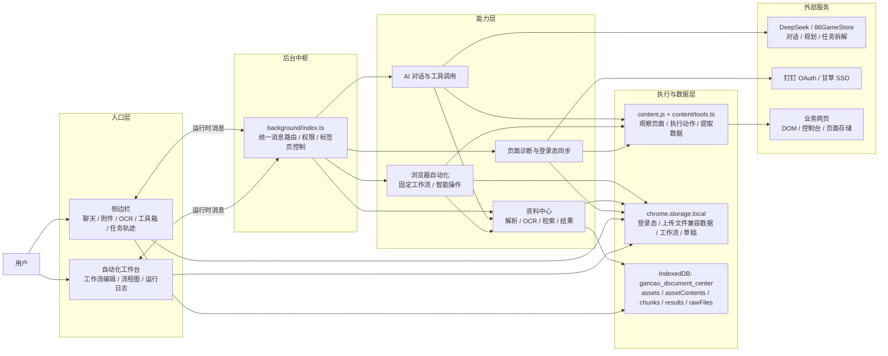
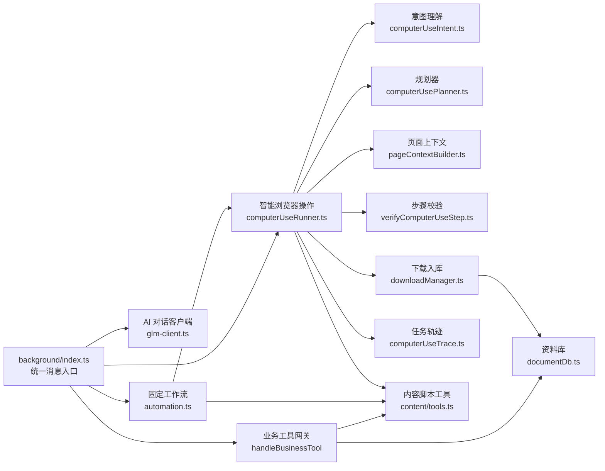
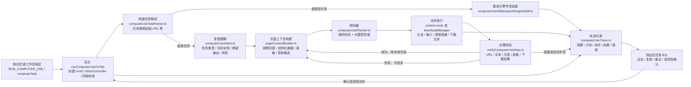
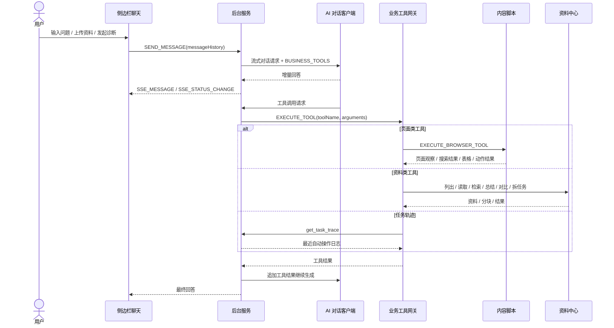
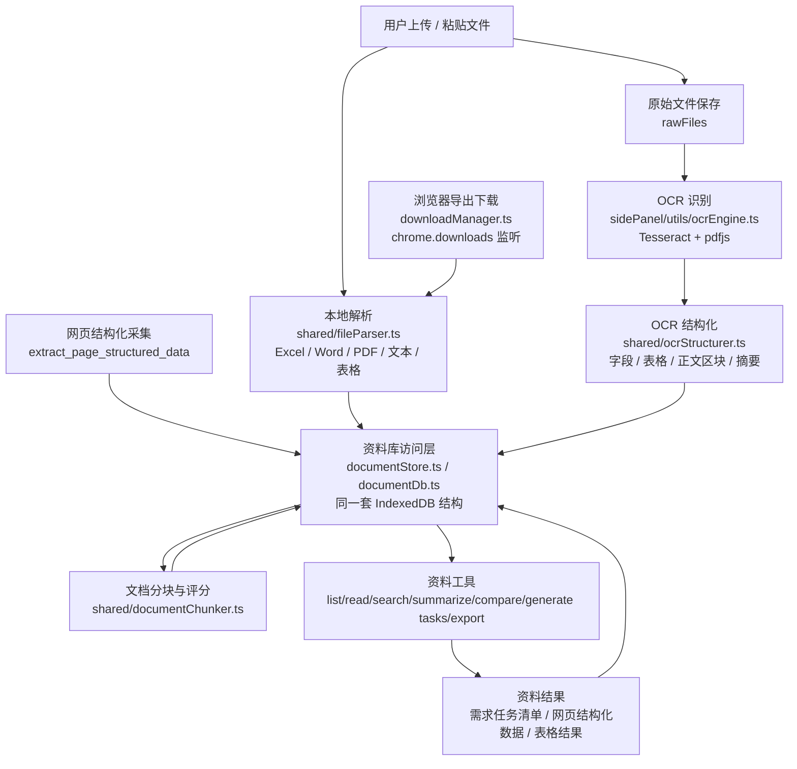
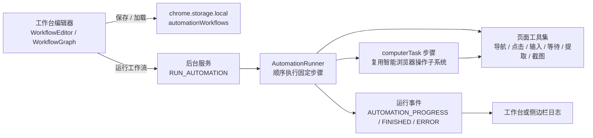

# 甘草 Copilot 架构图

当前项目是一个 Manifest V3 Chrome 扩展。Vite 打包 4 个运行入口：

- `sidePanel.js`: 插件侧边栏，承载登录、聊天、文件上传、资料中心、OCR 和工具箱。
- `dashboard.js`: 自动化工作台，承载工作流列表、工作流编辑器、流程图和运行日志。
- `background.js`: 扩展后台模块化服务工作线程，是消息路由、AI 编排、页面工具网关、自动化执行、下载入库和资料工具中心。
- `content.js`: 注入业务页面，负责页面观察、DOM 动作执行、搜索结果提取、控制台错误采集、选中文本入口和页面登录态同步。

## 总体架构图

这张图只表达主调用链：用户从入口层发起动作，所有请求先进入后台中枢，再分发到能力层，最后落到页面执行、本地数据或外部服务。细节模块放在后面的专项图里。

## 后台核心模块图

## 智能浏览器操作闭环

## 聊天与工具调用流程

## 资料中心数据流

## 自动化工作流流程

## 模块职责

| 模块 | 职责 |
| --- | --- |
| `src/sidePanel` | 用户主入口：登录、聊天、附件解析、结构化 OCR、资料中心入口、工具箱、智能操作任务卡片。 |
| `src/dashboard` | 工作流增删改查、可视化编排、固定流程运行控制和运行日志展示。 |
| `src/background/index.ts` | 插件核心编排：运行时消息、权限、标签页控制、AI 客户端、工具路由、自动化调度、下载入库、登录态同步。 |
| `src/background/computerUse*.ts` | 智能浏览器操作子系统：意图理解、页面上下文、规则/LLM 规划、执行结果校验、轨迹记录。 |
| `src/background/downloadManager.ts` | 真实导出/下载动作：监听 `chrome.downloads`，尝试读取下载内容，解析后保存到资料中心。 |
| `src/content` | 页面侧执行层：DOM 观察、元素语义识别、搜索结果提取、浏览器动作、页面结构化提取、控制台错误缓存、登录态读取。 |
| `src/shared` | 跨入口共享类型、业务工具声明、文件解析、文档分块、OCR 结构化、Computer Use 结果汇总、导出器。 |
| `src/sidePanel/utils/documentStore.ts` 与 `src/background/documentDb.ts` | 两套入口各自访问同一个 `gancao_document_center` IndexedDB，用于资料、内容、分块、结果和原始文件。 |
| `public` | Manifest、HTML 壳、钉钉登录脚本、页面控制台桥接脚本。 |

## 架构备注

- `background/index.ts` 仍是最核心的编排点，但 Computer Use 已经拆成多个独立模块，执行链路比上一版更清晰。
- `content/tools.ts` 现在不只是执行动作，还会给元素打上 `purpose`、`region`、`context`、`score`，供智能操作规划使用。
- 自动操作结果会进入内存轨迹 `computerUseTrace.ts`，侧边栏再以任务卡片形式展示、复制和重试。
- 下载文件不再只是点击按钮：`download_file` 会等待真实下载事件，并尽量把下载文件解析后写入资料中心。
- 资料中心同时接收上传文件、OCR 结构化结果、网页结构化采集和下载文件；最终统一走文档分块与检索工具。
- 当前聊天附件上下文以本地解析文本、表格和 OCR 为主；代码里仍保留大模型文件上传工具，但侧边栏当前标记为跳过原生文件上传。
