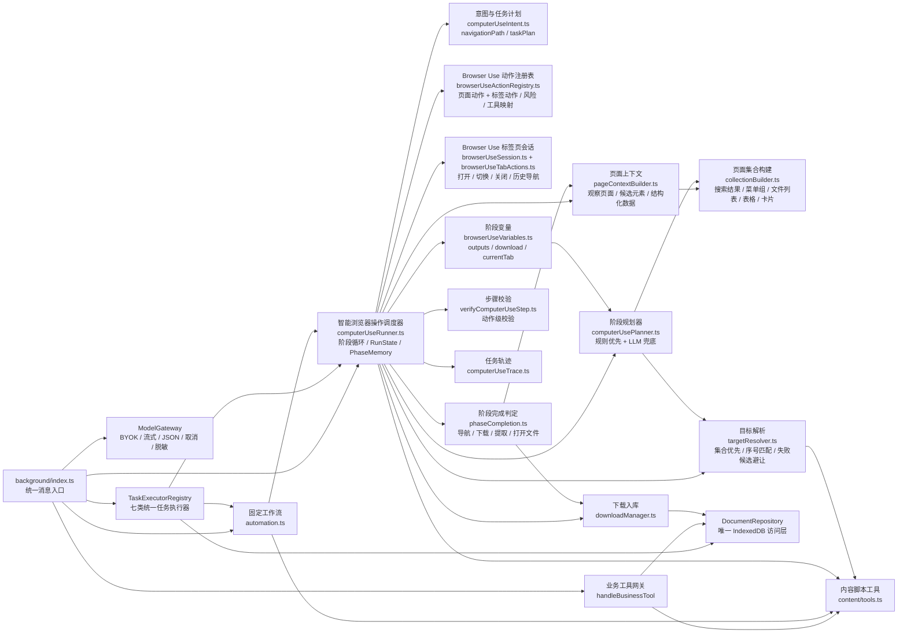
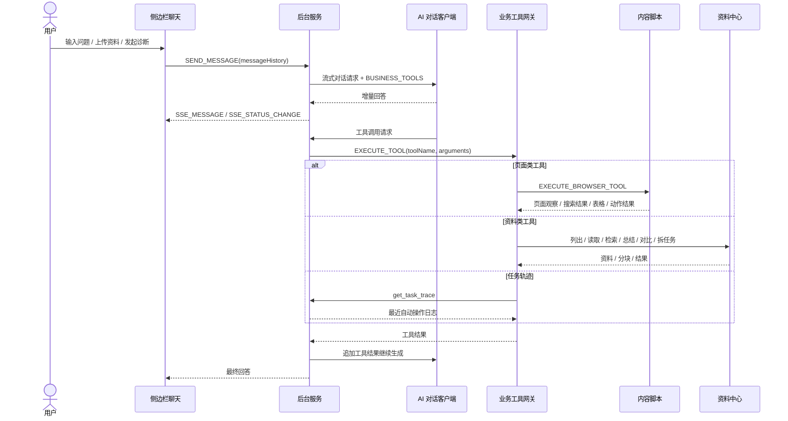
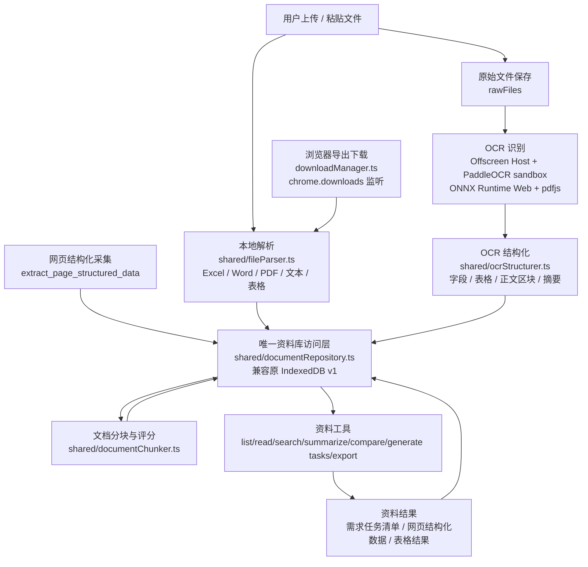
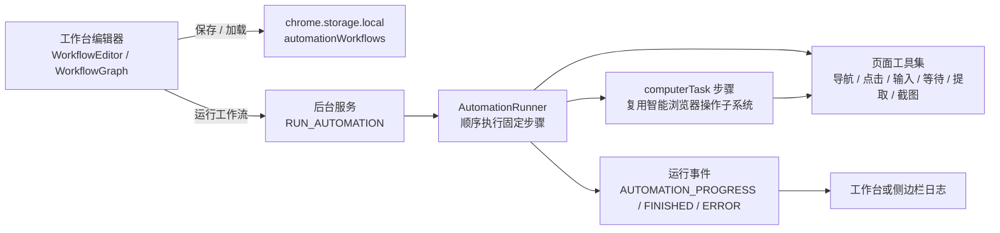

# 甘草 Copilot 架构图

当前项目是一个 Manifest V3 Chrome 扩展。Vite 打包 6 个运行入口：

- `sidePanel.js`: 插件侧边栏，承载登录、聊天、文件上传、资料中心、OCR 和工具箱。
- `dashboard.js`: 自动化工作台，承载工作流列表、工作流编辑器、流程图和运行日志。
- `background.js`: 扩展后台模块化服务工作线程，是消息路由、AI 编排、页面工具网关、自动化执行、下载入库和资料工具中心。
- `content.js`: 注入业务页面，负责页面观察、DOM 动作执行、搜索结果提取、控制台错误采集、选中文本入口和页面登录态同步。
- `ocrHost.js`: Offscreen Document OCR 宿主，在 SidePanel 关闭后继续运行 PaddleOCR 任务。
- `paddleocrSandbox.js`: Chrome sandbox 中的 PaddleOCR/ONNX Runtime，隔离需要 eval 的模型运行时。

## V3.2 统一底座

- `ModelGateway`: background-only 模型网关，读取用户本地配置，统一流式对话、JSON 规划、文本补全、取消和连接测试。SidePanel 不持有 API Key，也不直接请求模型服务。
- `DocumentRepository`: 唯一资料访问层，沿用 `gancao_document_center` v1，不重建已有资料；旧 `documentDb/documentStore` 仅保留兼容 re-export。
- `TaskExecutorRegistry`: 统一运行 `computer_use / page_monitor / page_diagnosis / document_qa / ocr / extract / workflow`，统一状态、停止、结果和 trace snapshot。`computer_use` 是 Browser Use 的历史兼容类型。

## V3.3-V4 产品能力

- 任务结果不再只有 trace JSON。任务中心按 Browser Use 下载、资料问答引用、OCR、页面诊断和结构化提取显示交付结果卡。
- 成功 Browser Use 任务可保存为参数化 `computerTask` 工作流；`{{variable}}` 占位符和任务配置中的默认参数会写入 workflow，运行任务可用 `metadata.variables` 覆盖默认值。
- 页面监控支持内容变化、包含目标内容、数值阈值、新增记录和状态转换规则。监控定义保存在任务记录中，每次检查写入独立历史；连续失败达到上限后自动暂停 alarm。
- 页面监控命中规则后可投递 Chrome 通知、飞书、钉钉和通用 Webhook；通知结果单独记录，不改变页面采集本身的成功状态。
- Memory 会话支持搜索、重命名、归档、删除和继续会话；明确偏好、流程和术语会生成待确认候选，确认后才进入长期召回。
- 资料资产可归属本地资料空间。旧资料保持无空间归属，不触发 IndexedDB 重建或数据迁移。
- 资料问答来源可打开对应资料并显示页码、章节或 chunk；OCR 人工校正保留原文并重建结构化索引。
- 自定义命令保存在 `chrome.storage.local`，支持 prompt/task 两种执行模式、输入表单、模板变量、模型路由、版本回滚以及 JSON 导入导出；Chat 命令菜单动态合并内置和自定义命令。
- `Automation Task Center`: 所有任务类型均可配置、运行、停止、查看结果和重试。Service Worker 重启后遗留 running 任务会安全收口为 stopped。
- Browser Use 失败任务保存 `ComputerUseResumeCheckpoint`；同一任务重试时从失败 phase 继续，不重复已完成阶段。

## Browser Use 目标

Browser Use 是自动化能力的正式产品名称和演进目标。它只负责浏览器中的自主任务执行：理解目标、观察标签页、制定短计划、执行原子动作、校验结果、失败恢复并交付页面数据或文件。页面诊断、资料问答、OCR、Memory 和监控作为可被 Browser Use 调用或承接结果的协作能力存在。

内部 `ComputerUse*` 类型、`computer_use` 任务类型和 `RUN_COMPUTER_USE` 等消息名暂时保留，用于兼容已有任务记录、工作流与扩展消息协议；新增用户界面和文档统一使用 Browser Use。

## 总体架构图

这张图只表达主调用链：用户从入口层发起动作，所有请求先进入后台中枢，再分发到能力层，最后落到页面执行、本地数据或外部服务。Browser Use 的阶段化执行细节放在后面的专项图里。

## 后台核心模块图

## 智能浏览器操作闭环

```mermaid
flowchart LR
  Start["侧边栏或工作流发起<br/>RUN_COMPUTER_USE / computerTask"]
  Router["后台 runComputerUseOnTab<br/>创建 runId / AbortController / 初始轨迹"]
  Parser["轻量预解析<br/>computerUseTaskParser.ts<br/>识别 URL / 站点别名 / 低风险信号"]
  Intent["意图与任务计划<br/>computerUseIntent.ts<br/>统一生成 taskPlan.phases"]
  PhaseLoop["阶段循环<br/>ComputerUsePhase<br/>按阶段推进"]
  Context["页面上下文构建<br/>pageContextBuilder.ts<br/>观察页面 / 候选元素 / 结构化数据"]
  Collections["语义集合<br/>collectionBuilder.ts + get_search_results<br/>菜单组 / 搜索结果 / 文件列表 / 表格"]
  Planner["阶段规划器<br/>computerUsePlanner.ts<br/>规则优先 + LLM 兜底"]
  Resolver["目标解析<br/>targetResolver.ts<br/>优先匹配 collections，再回退元素"]
  Act["动作执行<br/>content tools 或 downloadManager<br/>点击 / 输入 / 快捷键 / 提取 / 下载"]
  Verify["动作级校验<br/>verifyComputerUseStep.ts<br/>URL / 文本 / 元素 / 表格 / 下载结果"]
  PhaseDone["阶段完成判定<br/>phaseCompletion.ts<br/>是否进入下一阶段 / 是否结束"]
  Memory["运行状态与阶段记忆<br/>RunState / PhaseMemory<br/>标签页 / 阶段输出 / 下载结果 / 失败候选"]
  Tabs["标签页会话<br/>BrowserUseSession<br/>当前标签页 / 新标签页跟随"]
  Actions["动作注册表<br/>Browser Use Action Registry<br/>原子动作 / 风险 / 页面工具"]
  Trace["轨迹记录<br/>computerUseTrace.ts<br/>观察 / 计划 / 动作 / 结果 / 错误"]
  UI["侧边栏任务卡片<br/>日志 / 复制 / 重试 / 高风险确认"]

  Start --> Router
  Router --> Parser
  Parser --> Intent
  Intent --> PhaseLoop
  PhaseLoop --> Context
  PhaseLoop --> Memory
  PhaseLoop --> Tabs
  Context --> Collections
  Context --> Planner
  Collections --> Planner
  Planner --> Resolver
  Resolver --> Actions
  Actions --> Act
  Act --> Verify
  Verify --> PhaseDone
  PhaseDone -->|"阶段完成"| PhaseLoop
  PhaseDone -->|"任务完成"| Trace
  PhaseDone -->|"未完成，继续观察"| Context
  Resolver -->|"目标缺失或候选失败"| Memory
  Memory --> Planner
  Verify -->|"阻塞或连续失败"| Trace
  Act --> Trace
  Router --> Trace
  Trace --> UI
  UI -->|"确认高风险动作"| Router
```

## 聊天与工具调用流程

## 资料中心数据流

## 自动化工作流流程

## 模块职责

| 模块 | 职责 |
| --- | --- |
| `src/sidePanel` | 用户主入口：登录、聊天、附件解析、结构化 OCR、资料中心入口、工具箱、智能操作任务卡片。 |
| `src/dashboard` | 工作流增删改查、可视化编排、固定流程运行控制和运行日志展示。 |
| `src/background/index.ts` | 插件核心编排：运行时消息、权限、标签页控制、AI 客户端、工具路由、自动化调度、下载入库、登录态同步。 |
| `src/background/computerUse*.ts` | 智能浏览器操作子系统：意图理解、任务计划、阶段循环、规则/LLM 规划、动作校验和轨迹记录。 |
| `src/background/collectionBuilder.ts` | 从页面观察结果中整理语义集合：搜索结果、菜单组、文件列表、表格和卡片，减少规划器直接面对零散 DOM 的成本。 |
| `src/background/targetResolver.ts` | 把计划步骤中的目标解析成真实元素或坐标，优先使用集合、序号、父路径和阶段记忆，避免重复点击失败候选。 |
| `src/background/browserUseActionRegistry.ts` | Browser Use 原子动作注册表，统一动作到页面工具的映射、参数归一化、风险等级和新标签页能力。 |
| `src/background/browserUseSession.ts` | Browser Use 标签页会话，记录初始/当前标签页并在动作打开直接子标签页后继续接管。 |
| `src/background/phaseCompletion.ts` | 统一判断阶段是否完成，覆盖页面导航、下载完成、数据提取、打开文件中心和点击最近下载文件等场景。 |
| `src/background/downloadManager.ts` | 真实导出/下载动作：监听 `chrome.downloads`，尝试读取下载内容，解析后保存到资料中心。 |
| `src/content` | 页面侧执行层：DOM 观察、元素语义识别、搜索结果提取、点击/双击/右键/坐标点击/快捷键等浏览器动作、页面结构化提取、控制台错误缓存、登录态读取。 |
| `src/shared` | 跨入口共享类型、业务工具声明、文件解析、文档分块、OCR 结构化、Computer Use 结果汇总、导出器。 |
| `src/sidePanel/utils/documentStore.ts` 与 `src/background/documentDb.ts` | 两套入口各自访问同一个 `gancao_document_center` IndexedDB，用于资料、内容、分块、结果和原始文件。 |
| `public` | Manifest、HTML 壳、钉钉登录脚本、页面控制台桥接脚本。 |

## 架构备注

- `background/index.ts` 仍是最核心的编排点，但 Browser Use 已经拆成“意图/计划、页面上下文、集合构建、目标解析、动作注册、标签页会话、阶段完成判定、轨迹记录”等独立模块。
- Browser Use 现在以兼容类型 `ComputerUseTaskPlan` 和 `ComputerUsePhase` 推进任务；`RunState` 记录标签页会话、阶段输出、下载结果、完成阶段和警告，`PhaseMemory` 记录失败候选，避免在同一阶段反复点错。
- `pageContextBuilder.ts` 会把 `observe_page` 结果加工成 `ObservedCollection`，规划器和目标解析器优先使用这些集合，而不是只依赖零散元素列表。
- 搜索任务不再作为入口级独立链路分流：`open_site / search / select_collection_item` 也进入统一 phase runner。搜索结果由 `get_search_results` 转成 `search_results` 集合，再通过 `TargetResolver` 按 ordinal 解析第 N 个自然结果。
- `content/tools.ts` 现在不只是执行动作，还会给元素打上 `purpose`、`region`、`context`、`score`，并支持双击、右键、坐标点击、清空输入、聚焦和快捷键等更细的操作。
- 自动操作结果会进入内存轨迹 `computerUseTrace.ts`，侧边栏再以任务卡片形式展示、复制和重试。
- 下载文件不再只是点击按钮：`download_file` 会等待真实下载事件，并尽量把下载文件解析后写入资料中心。
- 资料中心同时接收上传文件、OCR 结构化结果、网页结构化采集和下载文件；最终统一走文档分块与检索工具。
- 当前聊天附件上下文以本地解析文本、表格和 OCR 为主；代码里仍保留大模型文件上传工具，但侧边栏当前标记为跳过原生文件上传。
