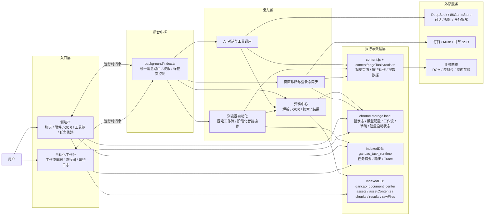
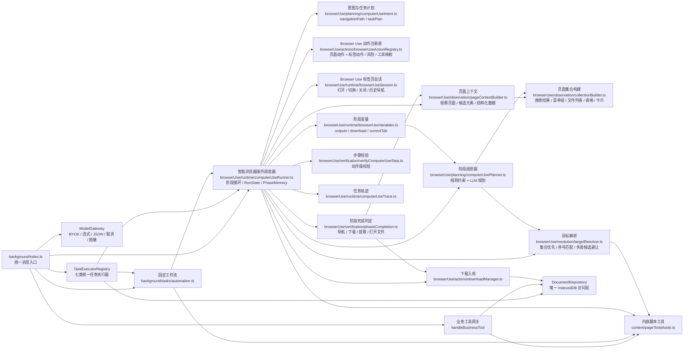
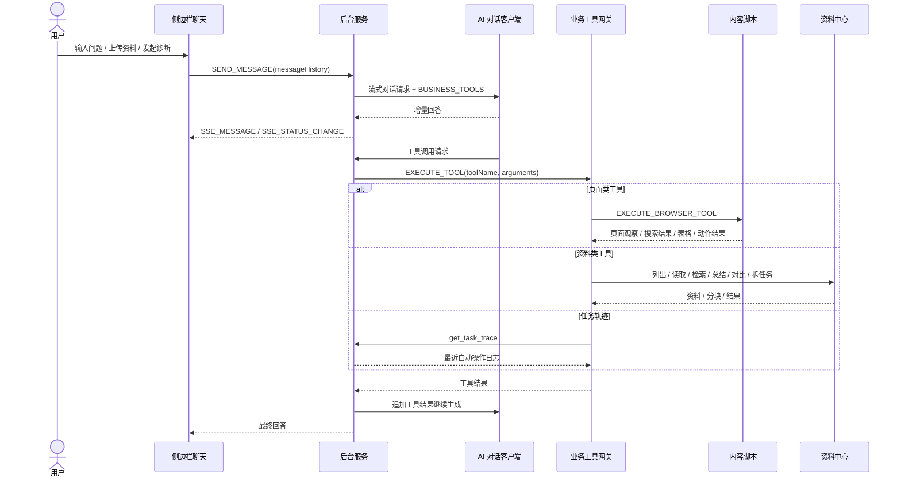
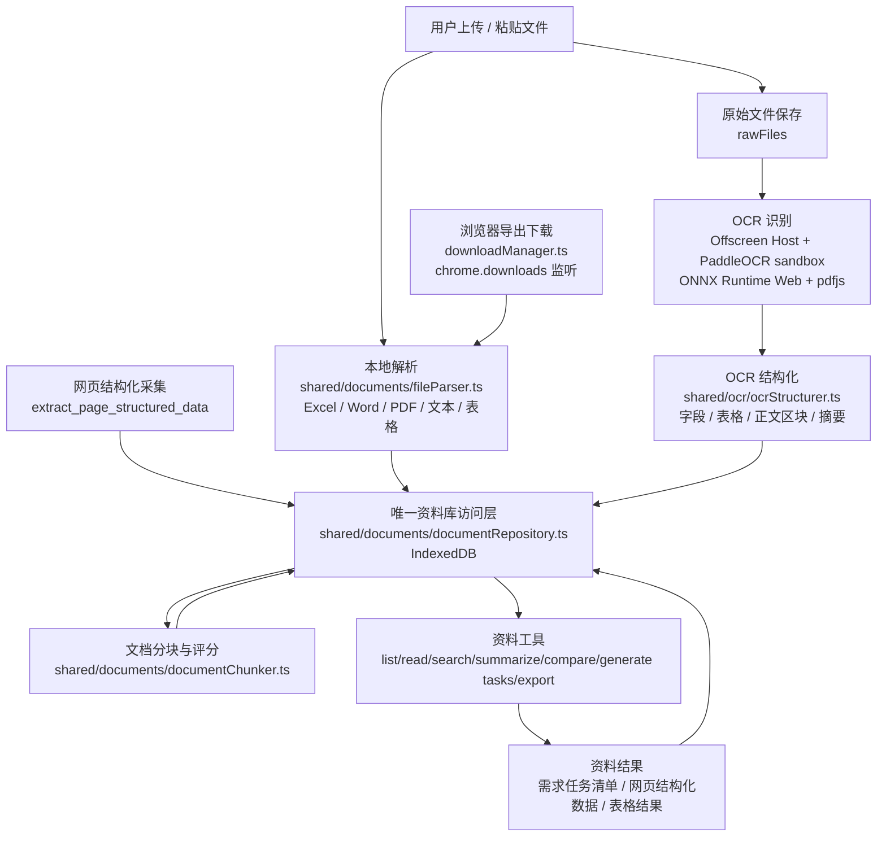
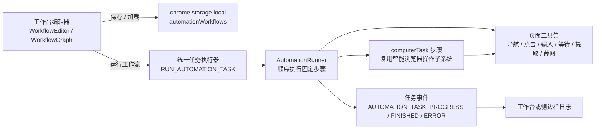

# 甘草 Copilot 技术架构

## 文档索引

- [项目 README](../README.md)：能力概览、开发运行、目录和质量基线。
- [Browser Use 技术架构](./browser-use-architecture.md)：自动化内核的分层图、阶段时序、语义模型、可靠性与安全边界。
- [Browser Use 产品目标](./browser-use-goal.md)：产品定位、能力边界和完成标准。
- [Browser Use 可靠性门禁](./browser-use-reliability.md)：观察质量、目标租约、黄金任务和发布要求。

当前项目是一个 Manifest V3 Chrome 扩展。Vite 打包 6 个运行入口：

- `sidePanel.js`: 插件侧边栏，承载登录、聊天、文件上传、资料中心、OCR 和工具箱。
- `dashboard.js`: 自动化工作台，承载工作流列表、工作流编辑器、流程图和运行日志。
- `background.js`: 扩展后台模块化服务工作线程，是消息路由、AI 编排、页面工具网关、自动化执行、下载入库和资料工具中心。
- `content.js`: 注入业务页面，负责页面观察、DOM 动作执行、搜索结果提取、控制台错误采集、选中文本入口和页面登录态同步。
- `ocrHost.js`: Offscreen Document OCR 宿主，在 SidePanel 关闭后继续运行 PaddleOCR 任务；负责读取资料原文件、逐页进度和结果入库。
- `paddleocrSandbox.js`: 独立 `src/sandbox` 运行时中的 PaddleOCR/ONNX Runtime，隔离需要 eval 的模型代码，不属于 SidePanel 依赖图。

## V3.2 统一底座

- `ModelGateway`: background-only 模型网关，读取用户本地配置，统一流式对话、JSON 规划、文本补全、取消和连接测试。SidePanel 不持有 API Key，也不直接请求模型服务。
- `DocumentRepository`: 唯一资料访问层，所有上传、OCR、下载入库和资料问答都通过该仓库读写。重复的 `documentDb/documentStore` 已删除。
- `TaskExecutorRegistry`: 统一运行 `browser_use / page_monitor / page_diagnosis / document_qa / ocr / extract / workflow`，统一状态、停止、结果和 trace snapshot。
- `PageContextHub`: 页面诊断的唯一页面上下文入口，单次并行采集页面信息、语义观察、结构化数据、表格和控制台错误，并在发送给模型前压缩为有限摘要。
- `pageSignals`: Content、PageContextHub 和 Browser Use 共用的页面信号定义与推导逻辑，统一登录、验证码、权限、空状态及脚本/资源/网络错误判断。
- `DocumentContextHub`: 资料问答的唯一资料上下文入口，负责 chunk 检索、全文兜底、引用来源和 OCR/解析可靠性警告，不混入无关页面内容。

## 扩展级验收矩阵

Playwright 使用持久化 Chromium Context 加载生产构建后的 `dist`，直接经过 Chrome runtime、Service Worker、Content Script、Offscreen Document、Sandbox、IndexedDB 和 downloads/alarms API 验收跨上下文闭环。

| 能力 | 扩展级验收内容 |
| --- | --- |
| 模型与聊天 | 配置 OpenAI-compatible 测试模型、接收流式内容、停止生成且不产生 final 消息。 |
| 页面诊断 | 采集当前业务页和错误上下文，运行统一诊断任务并持久化诊断输出。 |
| 资料问答 | 写入真实资料资产和 chunk，运行资料问答并返回文件名、页码、章节和 chunk 引用。 |
| PaddleOCR | 通过后台 OCR 任务识别图片与扫描 PDF，并验证结构化结果写回统一资料库。 |
| 页面监控 | 创建 alarm、执行初次快照、修改页面内容、再次运行并验证变化时间和 hash。 |
| Workflow / Memory / Auth | 运行固定工作流、扩展重载后恢复本地会话与长期记忆、验证页面登录和退出联动。 |
| Browser Use | 同名菜单、表单筛选、真实下载、文件中心、失败恢复、延迟 DOM 和新标签页接管。 |

PaddleOCR 的 PDF 页面渲染使用 PDF.js `print` intent。Offscreen Document 是隐藏页面，默认 `display` intent 依赖的 `requestAnimationFrame` 可能被浏览器暂停；生产代码同时设置页渲染超时，异常 PDF 不会留下永久运行任务。

## V3.3-V4 产品能力

- 任务结果不再只有 trace JSON。任务中心按 Browser Use 下载、资料问答引用、OCR、页面诊断和结构化提取显示交付结果卡。
- 成功 Browser Use 任务可保存为参数化 `computerTask` 工作流；`{{variable}}` 占位符和任务配置中的默认参数会写入 workflow，运行任务可用 `metadata.variables` 覆盖默认值。
- 页面监控支持内容变化、包含目标内容、数值阈值、新增记录和状态转换规则。监控定义保存在任务记录中，每次检查写入独立历史；连续失败达到上限后自动暂停 alarm。
- 页面监控命中规则后可投递 Chrome 通知、飞书、钉钉和通用 Webhook；通知结果单独记录，不改变页面采集本身的成功状态。
- Memory 会话支持搜索、重命名、归档、删除和继续会话；明确偏好、流程和术语会生成待确认候选，确认后才进入长期召回。
- 资料资产可归属本地资料空间。旧资料保持无空间归属，不触发 IndexedDB 重建或数据迁移。
- 资料问答来源可打开对应资料并显示页码、章节或 chunk；OCR 人工校正保留原文并重建结构化索引。
- 自定义命令保存在 `chrome.storage.local`，支持 prompt/task 两种执行模式、输入表单、模板变量、模型路由、版本回滚以及 JSON 导入导出；Chat 命令菜单动态合并内置和自定义命令。
- `Automation Task Center`: 所有任务类型均可配置、运行、停止、查看结果和重试。Service Worker 重启后遗留 running 任务会安全收口为 stopped。
- Browser Use 失败任务保存 `ComputerUseResumeCheckpoint`；同一任务重试时从失败 phase 继续，不重复已完成阶段。

## Browser Use 目标

Browser Use 是自动化能力的正式产品名称和演进目标。它只负责浏览器中的自主任务执行：理解目标、观察标签页、制定短计划、执行原子动作、校验结果、失败恢复并交付页面数据或文件。页面诊断、资料问答、OCR、Memory 和监控作为可被 Browser Use 调用或承接结果的协作能力存在。

Browser Use 的完整模块图和阶段时序见 [Browser Use 技术架构](./browser-use-architecture.md)，真实 Chromium 黄金任务、Observe 质量报告和发布门槛见 [Browser Use 可靠性门禁](./browser-use-reliability.md)。

`browser_use` 是 Browser Use 的唯一任务类型；`ComputerUse*` 只保留为执行器内部算法类型。所有长任务统一由 `TaskExecutorRegistry` 接收 `RUN_AUTOMATION_TASK`。

## 总体架构图

这张图只表达主调用链：用户从入口层发起动作，所有请求先进入后台中枢，再分发到能力层，最后落到页面执行、本地数据或外部服务。Browser Use 的阶段化执行细节放在后面的专项图里。

```mermaid
flowchart LR
  User["用户"]

  subgraph Entry["入口层"]
    SidePanel["侧边栏<br/>聊天 / 附件 / OCR / 工具箱 / 任务轨迹"]
    Dashboard["自动化工作台<br/>工作流编辑 / 流程图 / 运行日志"]
  end

  subgraph Hub["后台中枢"]
    Background["background/index.ts<br/>统一消息路由 / 权限 / 标签页控制"]
  end

  subgraph Capability["能力层"]
    ChatAI["AI 对话与工具调用"]
    BrowserAuto["浏览器自动化<br/>固定工作流 / 阶段化智能操作"]
    DocCenter["资料中心<br/>解析 / OCR / 检索 / 结果"]
    Diagnostics["页面诊断与登录态同步"]
  end

  subgraph RuntimeData["执行与数据层"]
    Content["content.js + content/pageTools/tools.ts<br/>观察页面 / 执行动作 / 提取数据"]
    ChromeStorage["chrome.storage.local<br/>登录态 / 模型配置 / 工作流 / 草稿 / 轻量启动状态"]
    TaskRepository["IndexedDB: gancao_task_runtime<br/>任务摘要 / 输出 / Trace"]
    IndexedDB["IndexedDB: gancao_document_center<br/>assets / assetContents / chunks / results / rawFiles"]
  end

  subgraph External["外部服务"]
    LLM["DeepSeek / 86GameStore<br/>对话 / 规划 / 任务拆解"]
    DingTalk["钉钉 OAuth / 甘草 SSO"]
    WebPage["业务网页<br/>DOM / 控制台 / 页面存储"]
  end

  User --> SidePanel
  User --> Dashboard

  SidePanel <-->|"运行时消息"| Background
  Dashboard <-->|"运行时消息"| Background

  Background --> ChatAI
  Background --> BrowserAuto
  Background --> DocCenter
  Background --> Diagnostics

  ChatAI --> LLM
  ChatAI --> DocCenter
  ChatAI --> Content

  BrowserAuto --> Content
  BrowserAuto --> DocCenter
  BrowserAuto --> TaskRepository

  DocCenter --> IndexedDB
  DocCenter --> ChromeStorage

  Diagnostics --> Content
  Diagnostics --> ChromeStorage
  Diagnostics --> DingTalk

  Content --> WebPage
  SidePanel --> ChromeStorage
  Dashboard --> ChromeStorage
  SidePanel --> TaskRepository
  Dashboard --> TaskRepository
  SidePanel --> IndexedDB
```

## 后台核心模块图

```mermaid
flowchart LR
  BG["background/index.ts<br/>统一消息入口"]
  Model["ModelGateway<br/>BYOK / 流式 / JSON / 取消 / 脱敏"]
  Tasks["TaskExecutorRegistry<br/>七类统一任务执行器"]
  Gateway["业务工具网关<br/>handleBusinessTool"]
  Auto["固定工作流<br/>background/tasks/automation.ts"]
  CU["智能浏览器操作调度器<br/>browserUse/runtime/computerUseRunner.ts<br/>阶段循环 / RunState / PhaseMemory"]
  Intent["意图与任务计划<br/>browserUse/planning/computerUseIntent.ts<br/>navigationPath / taskPlan"]
  Planner["阶段规划器<br/>browserUse/planning/computerUsePlanner.ts<br/>规则约束 + LLM 规划"]
  Context["页面上下文<br/>browserUse/observation/pageContextBuilder.ts<br/>观察页面 / 候选元素 / 结构化数据"]
  Collections["页面集合构建<br/>browserUse/observation/collectionBuilder.ts<br/>搜索结果 / 菜单组 / 文件列表 / 表格 / 卡片"]
  Resolver["目标解析<br/>browserUse/resolution/targetResolver.ts<br/>集合优先 / 序号匹配 / 失败候选避让"]
  Actions["Browser Use 动作注册表<br/>browserUse/actions/browserUseActionRegistry.ts<br/>页面动作 + 标签动作 / 风险 / 工具映射"]
  Tabs["Browser Use 标签页会话<br/>browserUse/runtime/browserUseSession.ts<br/>打开 / 切换 / 关闭 / 历史导航"]
  Variables["阶段变量<br/>browserUse/runtime/browserUseVariables.ts<br/>outputs / download / currentTab"]
  PhaseDone["阶段完成判定<br/>browserUse/verification/phaseCompletion.ts<br/>导航 / 下载 / 提取 / 打开文件"]
  Verify["步骤校验<br/>browserUse/verification/verifyComputerUseStep.ts<br/>动作级校验"]
  Download["下载入库<br/>browserUse/actions/downloadManager.ts"]
  Trace["任务轨迹<br/>browserUse/runtime/computerUseTrace.ts"]
  DB["DocumentRepository<br/>唯一 IndexedDB 访问层"]
  Content["内容脚本工具<br/>content/pageTools/tools.ts"]

  BG --> Model
  BG --> Tasks
  BG --> Gateway
  BG --> Auto
  BG --> CU
  Tasks --> CU
  Tasks --> Auto
  Tasks --> DB
  Gateway --> DB
  Gateway --> Content
  Auto --> Content
  Auto --> CU
  CU --> Intent
  CU --> Context
  CU --> Planner
  CU --> Resolver
  CU --> Actions
  CU --> Variables
  Variables --> Planner
  CU --> Tabs
  CU --> PhaseDone
  CU --> Content
  CU --> Verify
  CU --> Download
  CU --> Trace
  Context --> Collections
  Planner --> Collections
  Planner --> Resolver
  Resolver --> Content
  PhaseDone --> Context
  PhaseDone --> Download
  Download --> DB
```

## 智能浏览器操作闭环

下面是主流程摘要。更完整的分层架构、单阶段时序、阶段契约和安全边界见 [Browser Use 技术架构](./browser-use-architecture.md)。

```mermaid
flowchart LR
  Start["侧边栏、任务中心或工作流发起<br/>RUN_AUTOMATION_TASK"]
  Registry["TaskExecutorRegistry<br/>选择 browser_use 执行器"]
  Router["后台 runComputerUseOnTab<br/>创建内部 runId / AbortController / 初始轨迹"]
  Parser["轻量预解析<br/>browserUse/planning/computerUseTaskParser.ts<br/>识别 URL / 站点别名 / 低风险信号"]
  Intent["意图与任务计划<br/>browserUse/planning/computerUseIntent.ts<br/>统一生成 taskPlan.phases"]
  PhaseLoop["阶段循环<br/>ComputerUsePhase<br/>按阶段推进"]
  Context["页面上下文构建<br/>browserUse/observation/pageContextBuilder.ts<br/>观察页面 / 候选元素 / 结构化数据"]
  Collections["语义集合<br/>browserUse/observation/collectionBuilder.ts<br/>菜单组 / 搜索结果 / 文件列表 / 表格"]
  Planner["阶段规划器<br/>browserUse/planning/computerUsePlanner.ts<br/>规则约束 + LLM 规划"]
  Resolver["目标解析<br/>browserUse/resolution/targetResolver.ts<br/>优先匹配 collections，再回退元素"]
  Act["动作执行<br/>content tools 或 downloadManager<br/>点击 / 输入 / 快捷键 / 提取 / 下载"]
  Verify["动作级校验<br/>browserUse/verification/verifyComputerUseStep.ts<br/>URL / 文本 / 元素 / 表格 / 下载结果"]
  PhaseDone["阶段完成判定<br/>browserUse/verification/phaseCompletion.ts<br/>是否进入下一阶段 / 是否结束"]
  Memory["运行状态与阶段记忆<br/>RunState / PhaseMemory<br/>标签页 / 阶段输出 / 下载结果 / 失败候选"]
  Tabs["标签页会话<br/>BrowserUseSession<br/>当前标签页 / 新标签页跟随"]
  Actions["动作注册表<br/>Browser Use Action Registry<br/>原子动作 / 风险 / 页面工具"]
  Trace["轨迹记录<br/>browserUse/runtime/computerUseTrace.ts<br/>观察 / 计划 / 动作 / 结果 / 错误"]
  UI["侧边栏任务卡片<br/>日志 / 复制 / 重试 / 高风险确认"]

  Start --> Registry
  Registry --> Router
  Router --> Parser
  Parser --> Intent
  Intent --> PhaseLoop
  PhaseLoop --> Context
  PhaseLoop --> Memory
  PhaseLoop --> Tabs
  Context --> Collections
  Context --> Planner
  Collections --> Planner
  Planner --> Resolver
  Resolver --> Actions
  Actions --> Act
  Act --> Verify
  Verify --> PhaseDone
  PhaseDone -->|"阶段完成"| PhaseLoop
  PhaseDone -->|"任务完成"| Trace
  PhaseDone -->|"未完成，继续观察"| Context
  Resolver -->|"目标缺失或候选失败"| Memory
  Memory --> Planner
  Verify -->|"阻塞或连续失败"| Trace
  Act --> Trace
  Router --> Trace
  Trace --> UI
  UI -->|"确认高风险动作"| Router
```

## 聊天与工具调用流程

```mermaid
sequenceDiagram
  actor User as 用户
  participant Chat as 侧边栏聊天
  participant BG as 后台服务
  participant AI as AI 对话客户端
  participant Tool as 业务工具网关
  participant CS as 内容脚本
  participant DB as 资料中心

  User->>Chat: 输入问题 / 上传资料 / 发起诊断
  Chat->>BG: SEND_MESSAGE(messageHistory)
  BG->>AI: 流式对话请求 + BUSINESS_TOOLS
  AI-->>BG: 增量回答
  BG-->>Chat: SSE_MESSAGE / SSE_STATUS_CHANGE
  AI->>BG: 工具调用请求
  BG->>Tool: EXECUTE_TOOL(toolName, arguments)
  alt 页面类工具
    Tool->>CS: EXECUTE_BROWSER_TOOL
    CS-->>Tool: 页面观察 / 搜索结果 / 表格 / 动作结果
  else 资料类工具
    Tool->>DB: 列出 / 读取 / 检索 / 总结 / 对比 / 拆任务
    DB-->>Tool: 资料 / 分块 / 结果
  else 任务轨迹
    Tool->>BG: get_task_trace
    BG-->>Tool: 最近自动操作日志
  end
  Tool-->>BG: 工具结果
  BG->>AI: 追加工具结果继续生成
  BG-->>Chat: 最终回答
```

## 页面感知 Chat 与专题来源

页面选区入口只负责收集用户主动选择的上下文并唤起 Side Panel，不在业务网页中渲染完整 AI 回答。普通会话以当前页面为主要来源；当页面覆盖不足时，Chat 可以把当前会话升级为专题模式，并继续收集其他网页或选区作为资料来源。

```mermaid
flowchart LR
  Selection["用户选择网页文本"]
  Toolbar["content/selection<br/>问 AI / 解释 / 加入专题 / 更多"]
  Relay["PAGE_CONTEXT_ACTION<br/>background handler + session storage"]
  Chat["ChatSession<br/>page / topic"]
  PageHub["PageContextHub<br/>当前页压缩摘要"]
  Scope["ResearchScopeDecider<br/>当前页回答或建议升级"]
  Repository["DocumentRepository<br/>专题来源资料"]
  QA["document_qa 任务<br/>限定 sourceDocumentIds"]
  Answer["页面回答 / 专题多来源回答<br/>标题、URL、章节或选区引用"]

  Selection --> Toolbar
  Toolbar --> Relay
  Relay --> Chat
  Chat --> PageHub
  PageHub --> Scope
  Scope -->|"当前页足够"| Answer
  Scope -->|"用户确认升级"| Repository
  Chat -->|"加入页面或选区"| Repository
  Repository --> QA
  QA --> Answer
```

- `PageSelectionContext` 保存选区正文、前后文、标题路径、URL、selector 和 viewport 坐标。
- `PAGE_CONTEXT_ACTION` 通过 `chrome.storage.session` 暂存，Side Panel 初始化后仍能消费，不依赖消息恰好在面板加载完成时到达。
- `ChatSession.mode = page | topic`；专题来源只保存 `sourceDocumentIds`，资料事实不写入长期 Memory。
- 专题问答复用统一资料问答任务，只检索当前会话的来源集合。
- 选区内容仅在用户点击工具条动作后发送或保存。

## 资料中心数据流

```mermaid
flowchart TB
  Upload["用户上传 / 粘贴文件"]
  LocalParse["本地解析<br/>shared/documents/fileParser.ts<br/>Excel / Word / PDF / 文本 / 表格"]
  RawFile["原始文件保存<br/>rawFiles"]
  OCR["OCR 识别<br/>Offscreen Host + PaddleOCR sandbox<br/>ONNX Runtime Web + pdfjs"]
  OCRStruct["OCR 结构化<br/>shared/ocr/ocrStructurer.ts<br/>字段 / 表格 / 正文区块 / 摘要"]
  WebCapture["网页结构化采集<br/>extract_page_structured_data"]
  Download["浏览器导出下载<br/>downloadManager.ts<br/>chrome.downloads 监听"]
  Store["唯一资料库访问层<br/>shared/documents/documentRepository.ts<br/>IndexedDB"]
  Chunk["文档分块与评分<br/>shared/documents/documentChunker.ts"]
  Tools["资料工具<br/>list/read/search/summarize/compare/generate tasks/export"]
  Results["资料结果<br/>需求任务清单 / 网页结构化数据 / 表格结果"]

  Upload --> LocalParse
  Upload --> RawFile
  RawFile --> OCR
  OCR --> OCRStruct
  Download --> LocalParse
  WebCapture --> Store
  LocalParse --> Store
  OCRStruct --> Store
  Store --> Chunk
  Chunk --> Store
  Store --> Tools
  Tools --> Results
  Results --> Store
```

## 自动化工作流流程

```mermaid
flowchart LR
  Editor["工作台编辑器<br/>WorkflowEditor / WorkflowGraph"]
  Storage["chrome.storage.local<br/>automationWorkflows"]
  BG["统一任务执行器<br/>RUN_AUTOMATION_TASK"]
  Runner["AutomationRunner<br/>顺序执行固定步骤"]
  Browser["页面工具集<br/>导航 / 点击 / 输入 / 等待 / 提取 / 截图"]
  ComputerTask["computerTask 步骤<br/>复用智能浏览器操作子系统"]
  Events["任务事件<br/>AUTOMATION_TASK_PROGRESS / FINISHED / ERROR"]
  UI["工作台或侧边栏日志"]

  Editor -->|"保存 / 加载"| Storage
  Editor -->|"运行工作流"| BG
  BG --> Runner
  Runner --> Browser
  Runner --> ComputerTask
  ComputerTask --> Browser
  Runner --> Events
  Events --> UI
```

## 模块职责

| 模块 | 职责 |
| --- | --- |
| `src/sidePanel` | 用户主入口：登录、聊天、附件解析、结构化 OCR、资料中心入口、工具箱、智能操作任务卡片。 |
| `src/dashboard` | 工作流增删改查、可视化编排、固定流程运行控制和运行日志展示。 |
| `src/background/index.ts` | Service Worker 入口：初始化依赖并注册消息监听，不承载领域实现。 |
| `src/background/handlers` | 模型、认证、任务、页面工具和页面上下文消息的路由层。 |
| `src/background/browserUse/planning` | Browser Use 的意图理解、任务编译、阶段计划和规则/LLM 规划。 |
| `src/background/browserUse/observation` | 页面观察、上下文压缩、语义集合构建和观察质量门禁。 |
| `src/background/browserUse/resolution` | 将语义目标解析为真实元素或坐标，并按父路径、序号和上下文消歧。 |
| `src/background/browserUse/actions` | 原子动作、标签页操作和真实下载捕获。 |
| `src/background/browserUse/verification` | 动作校验和阶段完成判定。 |
| `src/background/browserUse/runtime` | Runner、标签页会话、检查点、轨迹、变量和恢复状态。 |
| `src/background/tasks` | 统一任务运行时、执行器注册、页面监控和通知。 |
| `src/background/model` | Background-only 模型网关和客户端。 |
| `src/background/ocr` | OCR Job 生命周期和 Offscreen 调度。 |
| `src/content/pageTools` | DOM 观察、语义识别、页面动作、结构化提取、错误缓存和登录态读取。 |
| `src/content/selection` | 页面选区工具条和结构化选区上下文。 |
| `src/shared` | 按自动化、资料、上下文、Memory、模型、OCR 等领域组织的共享契约和纯逻辑。 |
| `src/shared/documents/documentRepository.ts` | 资料、内容、分块、结果和原始文件的唯一 IndexedDB 访问层。 |
| `public` | Manifest、HTML 壳、钉钉登录脚本、页面控制台桥接脚本。 |

## 架构备注

- `background/index.ts` 仅负责装配；Browser Use 按“计划、观察、解析、动作、校验、运行时”分层，任务、模型和 OCR 也拥有独立领域目录。
- Browser Use 由 `ComputerUseTaskPlan` 和 `ComputerUsePhase` 推进任务；`RunState` 记录标签页会话、阶段输出、下载结果、完成阶段和警告，`PhaseMemory` 记录失败候选，避免在同一阶段反复点错。
- `pageContextBuilder.ts` 会把 `observe_page` 结果加工成 `ObservedCollection`，规划器和目标解析器优先使用这些集合，而不是只依赖零散元素列表。
- 搜索任务不再作为入口级独立链路分流：`open_site / search / select_collection_item` 也进入统一 phase runner。搜索结果由 `get_search_results` 转成 `search_results` 集合，再通过 `TargetResolver` 按 ordinal 解析第 N 个自然结果。
- `content/pageTools/tools.ts` 现在不只是执行动作，还会给元素打上 `purpose`、`region`、`context`、`score`，并支持双击、右键、坐标点击、清空输入、聚焦和快捷键等更细的操作。
- 自动操作结果会进入内存轨迹 `computerUseTrace.ts`，侧边栏再以任务卡片形式展示、复制和重试。
- 下载文件不再只是点击按钮：`download_file` 会等待真实下载事件，并尽量把下载文件解析后写入资料中心。
- 资料中心同时接收上传文件、OCR 结构化结果、网页结构化采集和下载文件；最终统一走文档分块与检索工具。
- 当前聊天附件上下文以本地解析文本、表格和 OCR 为主；代码里仍保留大模型文件上传工具，但侧边栏当前标记为跳过原生文件上传。
