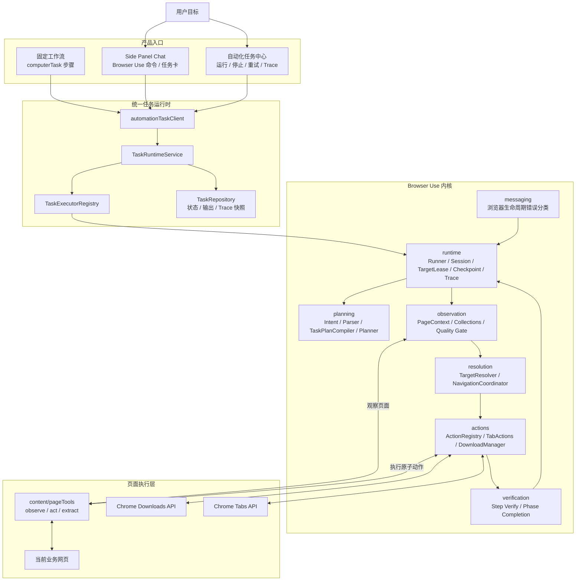
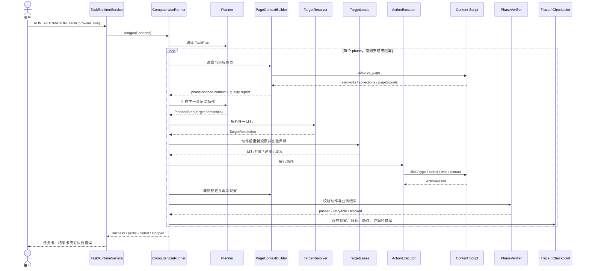
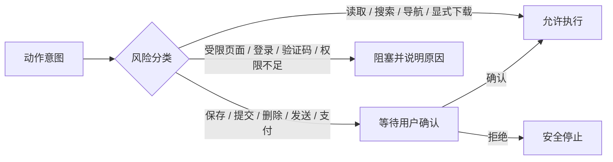

# Browser Use 技术架构

本文说明甘草 Copilot 中 Browser Use 的实现边界、运行链路、可靠性机制和源码入口。它面向需要维护自动化内核、排查任务失败或扩展页面能力的开发者。

Browser Use 是产品名称；源码中的 `ComputerUse*` 仅保留为内部算法和历史类型命名，不代表存在第二套执行链路。所有长任务都由统一任务运行时启动。

相关文档：

- [总体技术架构](./architecture.md)
- [Browser Use 产品目标](./browser-use-goal.md)
- [Browser Use 可靠性门禁](./browser-use-reliability.md)
- [项目 README](../README.md)

## 设计目标

Browser Use 接收用户希望在浏览器中完成的目标，在受控 Chrome 标签页内完成以下闭环：

```text
理解目标
→ 编译阶段计划
→ 观察页面
→ 构建语义集合
→ 解析唯一目标
→ 执行原子动作
→ 等待页面稳定
→ 验收业务结果
→ 继续、恢复或明确失败
```

设计约束：

- 不把业务 URL、菜单路径或 CSS selector 写死在通用内核中。
- LLM 负责理解目标和提出语义动作，不直接决定最终 DOM selector。
- 每个阶段必须有正向完成证据，禁止“点击过就算完成”。
- 找不到唯一目标时必须阻塞或重新观察，不允许模糊点击大容器。
- 保存、提交、删除、发送、支付等高风险动作必须由用户确认。
- 仅操作用户授权的 Chrome 标签页，不扩展为系统级桌面控制。

## 分层架构图



## 单阶段执行时序

Runner 只执行当前阶段的一小步计划。页面变化后会重新观察，不会把首次观察得到的 DOM 目标长期复用。



## TaskPlan 与阶段契约

`TaskPlanCompiler` 将规则候选和 LLM 候选编译成唯一可信计划。规则只补充 URL、等待时间、下载等确定性信息，不直接决定复杂中文业务路径。

| 阶段 | 典型目标 | 必要输入 | 完成证据 |
| --- | --- | --- | --- |
| `open_site` | 打开站点或新标签页 | URL 或可解析站点名 | 当前受控标签页进入目标站点 |
| `search` | 输入关键词并提交搜索 | query | 结果页状态、URL 或结果集合出现 |
| `select_collection_item` | 点击第 N 个自然结果或列表项 | collection type + ordinal/text | 离开集合页或进入目标 URL |
| `navigate_to_page` | 进入父子菜单目标页 | navigationPath | 正确父路径下 leaf active，或页面正文/路由命中 |
| `fill_form` | 选择筛选项、输入字段 | label/purpose + value | 控件实际值与目标值一致 |
| `click_action` | 查询、展开、普通命令 | action purpose/text | 页面状态或目标集合发生预期变化 |
| `extract_data` | 提取表格、列表、字段 | schema/collection target | 返回真实结构化数据 |
| `download_file` | 点击真实导出或行内下载 | `download_button` | 捕获下载完成或明确 partial |
| `open_page_or_center` | 打开文件中心、我的应用等入口 | 独立入口 target | URL、标题、导航 active 或正文命中 |
| `wait` | 等待页面或业务处理 | duration/condition | 时间或条件满足 |
| `click_latest_download` | 打开刚下载文件 | download result / filename | 文件 active、详情打开或页面包含文件名 |

阶段前置条件由 Runner 再次校验。计划缺少必要前置时会被修复或拒绝，不能直接进入页面乱点。

## 页面语义模型

Content Script 首先采集可交互元素，`collectionBuilder` 再把零散 DOM 元素组织成面向任务的语义集合：

| 集合 | 用途 | 关键上下文 |
| --- | --- | --- |
| `menu_group` | 顶部导航、侧边栏、父子菜单 | `parentPath`、level、active、expanded |
| `form_group` | Input、Select、DatePicker 等字段 | label、placeholder、controlType、currentValue |
| `action_group` | 查询、导出、保存、删除等动作 | purpose、actionKind、riskLevel、parentRegion |
| `table_row_group` | 表格行及行内按钮 | rowIndex、cells、rowText、actions、stableRowKey |
| `search_results` | 搜索引擎自然结果 | index、title、href、snippet、confidence |
| `file_list` | 文件中心的文件行或卡片 | filename、time、status、row actions |
| `table` / `cards` / `list` | 通用结构化集合 | index、text、metadata、sourceElementIds |

Planner 只输出 `collectionType / text / ordinal / parentPath / purpose` 等语义目标。`TargetResolver` 再按以下优先级映射为真实元素：

1. 集合类型与精确语义匹配；
2. 父路径、字段 label、动作 purpose 或行上下文匹配；
3. 序号、稳定键或明确 href 匹配；
4. selector candidate；
5. 坐标兜底。

无法得到唯一目标时返回 `TARGET_AMBIGUOUS` 或 `TARGET_STALE`，不执行猜测点击。

## 可靠性保护

### 观察质量门禁

`observationQuality` 检查集合覆盖率、重复 elementId、低置信度候选、缺失父路径、表单和表格元数据。当前阶段需要的集合不可靠时，会重新观察；仍不满足则明确失败。

### 页面稳定等待

Runner 对当前阶段相关集合生成页面指纹。只有页面状态连续稳定，才允许解析和执行目标。网络加载、DOM 重建、BFCache 恢复和标签页切换不会被固定睡眠时间误判为完成。

### 目标租约

Planner 选择目标后，`BrowserUseTargetLease` 会在动作提交前重新观察：

- elementId 变化但语义仍一致时安全重绑定；
- 第 N 项文本或链接变化时拒绝点击；
- 候选重新变得歧义时停止动作。

### 导航协调

`NavigationCoordinator` 把消息端口关闭、BFCache 和新标签页创建视为“待验收状态”，而不是立即失败。`BrowserUseSession` 只在任务窗口内跟踪当前受控标签页，并基于 opener、目标 href 和时间窗口接管新标签页。

### 失败恢复

失败时保存 `ComputerUseResumeCheckpoint`，包括：

- 已编译 TaskPlan；
- 当前失败 phase；
- 已完成阶段和阶段输出；
- 下载结果；
- 受控标签页会话；
- 最后观察、目标和失败预算。

从任务中心重试时从失败阶段继续，避免重复已完成的查询、导出或下载动作。

## 安全边界



- Chrome 内置页、Chrome Web Store 和无法注入 Content Script 的页面不可操作。
- 跨域 iframe 不能穿透操作；同源 iframe 可按页面工具能力处理。
- 登录、验证码、权限不足等信号优先于任务完成。
- 下载操作只在用户目标明确要求导出或下载时执行。
- Trace、错误和任务结果不得包含 API Key、Token 或密码。

## 源码目录

```text
src/background/browserUse/
├── planning/       # 意图、任务解析、TaskPlan 编译、短计划
├── observation/    # 标签页上下文、语义集合、质量评估、观察门禁
├── resolution/     # 目标解析与导航协调
├── actions/        # 原子动作、标签页动作、下载管理
├── verification/   # 动作校验与阶段完成判断
├── runtime/        # Runner、会话、目标租约、检查点、变量、Trace
└── messaging/      # 浏览器生命周期和消息错误分类

src/content/pageTools/       # 页面观察、动作、提取和页面信号
src/shared/automation/       # Browser Use 与统一任务的共享契约
src/background/tasks/        # TaskRuntimeService 与 TaskExecutorRegistry
src/sidePanel/components/Chat/browserUse/ # Browser Use 任务卡与 Trace UI
```

## Trace 与错误

每个阶段至少记录：

- 当前 phase 和自然语言目标；
- observation collections 摘要和质量报告；
- Planner 计划；
- TargetResolver 的选中目标、评分和被拒候选；
- 动作前后的 URL、标题和页面状态；
- verification 证据；
- fallback、重观察或恢复动作；
- 最终结果或错误码。

主要错误码：

- `OBSERVATION_INCOMPLETE`
- `TARGET_AMBIGUOUS`
- `TARGET_STALE`
- `ACTION_NO_EFFECT`
- `PAGE_NOT_SETTLED`
- `OUTCOME_NOT_REACHED`
- `BLOCKED_BY_AUTH`
- `DOWNLOAD_NOT_STARTED`
- `ACTION_EXECUTION_FAILED`

错误必须同时提供当前阶段、最后页面、失败原因和用户可执行的下一步建议。

## 测试与发布门禁

单元测试覆盖计划编译、集合构建、目标解析、目标租约、导航协调、动作校验、阶段完成和恢复检查点。

扩展 E2E 覆盖：

- 搜索并进入第 1、2、3 个自然结果；
- 同名父菜单下选择正确子菜单；
- 选择筛选项、输入字段、查询并下载指定行；
- 延迟 DOM 出现后点击真实导出；
- 导出后进入文件中心并打开同名文件；
- 新标签页接管、受限页面和失败恢复；
- 无正向证据时必须失败，不能伪装完成。

统一检查：

```bash
pnpm -s exec tsc --noEmit --pretty false
pnpm -s exec vitest run --config vitest.config.ts
pnpm -s exec vite build
pnpm -s exec playwright test
```

黄金任务连续五轮门禁：

```bash
pnpm test:browser-use:golden
```

发布标准详见 [Browser Use 可靠性门禁](./browser-use-reliability.md)。
